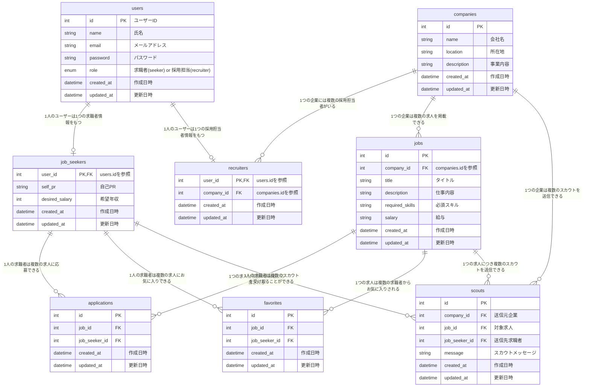

## ER図

```mermaid
erDiagram

    %% ---------------------------------------------------------
    %% 1. ユーザー (Users)
    %% ---------------------------------------------------------
    users {
        int id PK "ユーザーID"
        string name "氏名"
        string email "メールアドレス"
        string password "パスワード"
        enum role "求職者(seeker) or 採用担当(recruiter)"
        datetime created_at "作成日時"
        datetime updated_at "更新日時"
    }

    job_seekers {
        int user_id PK, FK "users.idを参照"
        string self_pr "自己PR"
        int desired_salary "希望年収"
        datetime created_at "作成日時"
        datetime updated_at "更新日時"
    }

    recruiters {
        int user_id PK, FK "users.idを参照"
        int company_id FK "companies.idを参照"
        datetime created_at "作成日時"
        datetime updated_at "更新日時"
    }

    %% ---------------------------------------------------------
    %% 2. 企業・求人
    %% ---------------------------------------------------------
    companies {
        int id PK
        string name "会社名"
        string location "所在地"
        string description "事業内容"
        datetime created_at "作成日時"
        datetime updated_at "更新日時"
    }

    jobs {
        int id PK
        int company_id FK "companies.idを参照"
        string title "タイトル"
        string description "仕事内容"
        string required_skills "必須スキル"
        string salary "給与"
        datetime created_at "作成日時"
        datetime updated_at "更新日時"
    }

    %% ---------------------------------------------------------
    %% 3. 応募
    %% ---------------------------------------------------------
    applications {
        int id PK
        int job_id FK
        int job_seeker_id FK
        datetime created_at "作成日時"
        datetime updated_at "更新日時"
    }

    %% ---------------------------------------------------------
    %% 4. お気に入り
    %% ---------------------------------------------------------
    favorites {
        int id PK
        int job_id FK
        int job_seeker_id FK
        datetime created_at "作成日時"
        datetime updated_at "更新日時"
    }

    %% ---------------------------------------------------------
    %% 5. スカウト（job_id 追加）
    %% ---------------------------------------------------------
    scouts {
        int id PK
        int company_id FK "送信元企業"
        int job_id FK "対象求人"
        int job_seeker_id FK "送信先求職者"
        string message "スカウトメッセージ"
        datetime created_at "作成日時"
        datetime updated_at "更新日時"
    }

    %% ---------------------------------------------------------
    %% リレーション
    %% ---------------------------------------------------------

    users ||--o| job_seekers : "1人のユーザーは1つの求職者情報をもつ"
    users ||--o| recruiters : "1人のユーザーは1つの採用担当者情報をもつ"

    companies ||--o{ recruiters : "1つの企業には複数の採用担当者がいる"
    companies ||--o{ jobs : "1つの企業は複数の求人を掲載できる"

    jobs ||--o{ applications : "1つの求人は複数の求職者に応募される"
    job_seekers ||--o{ applications : "1人の求職者は複数の求人に応募できる"

    jobs ||--o{ favorites : "1つの求人は複数の求職者からお気に入りされる"
    job_seekers ||--o{ favorites : "1人の求職者は複数の求人にお気に入りできる"

    companies ||--o{ scouts : "1つの企業は複数のスカウトを送信できる"
    jobs ||--o{ scouts : "1つの求人につき複数のスカウトを送信できる"
    job_seekers ||--o{ scouts : "1人の求職者は複数のスカウトを受け取ることができる"
```
