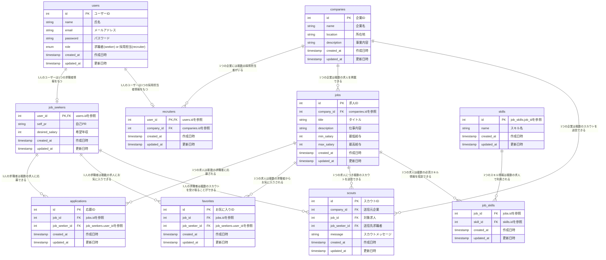

## ER図

```mermaid
erDiagram

    %% ---------------------------------------------------------
    %% 1. 全ユーザー
    %% ---------------------------------------------------------
    users {
        int id PK "ユーザーID"
        string name "氏名"
        string email "メールアドレス"
        string password "パスワード"
        enum role "求職者(seeker) or 採用担当(recruiter)"
        timestamp created_at "作成日時"
        timestamp updated_at "更新日時"
    }

    %% ---------------------------------------------------------
    %% 2. 求職者
    %% ---------------------------------------------------------

    job_seekers {
        int user_id PK, FK "users.idを参照"
        string self_pr "自己PR"
        int desired_salary "希望年収"
        timestamp created_at "作成日時"
        timestamp updated_at "更新日時"
    }

    %% ---------------------------------------------------------
    %% 3. 採用担当者
    %% ---------------------------------------------------------

    recruiters {
        int user_id PK, FK "users.idを参照"
        int company_id FK "companies.idを参照"
        timestamp created_at "作成日時"
        timestamp updated_at "更新日時"
    }

    %% ---------------------------------------------------------
    %% 4. 企業
    %% ---------------------------------------------------------
    companies {
        int id PK "企業ID"
        string name "企業名"
        string location "所在地"
        string description "事業内容"
        timestamp created_at "作成日時"
        timestamp updated_at "更新日時"
    }

    %% ---------------------------------------------------------
    %% 5. 求人
    %% ---------------------------------------------------------

    jobs {
        int id PK "求人ID"
        int company_id FK "companies.idを参照"
        string title "タイトル"
        string description "仕事内容"
        int min_salary "最低給与"
        int max_salary "最高給与"
        timestamp created_at "作成日時"
        timestamp updated_at "更新日時"
    }

    %% ---------------------------------------------------------
    %% 6. スキル(マスタテーブル)
    %% ---------------------------------------------------------
    skills {
        int id PK "job_skills.job_idを参照"
        string name "スキル名"
        timestamp created_at "作成日時"
        timestamp updated_at "更新日時"
    }

    %% ---------------------------------------------------------
    %% 7. 求人に紐つく必須スキル
    %% ---------------------------------------------------------
    job_skills {
        int job_id FK "jobs.idを参照"
        int skill_id FK "skills.idを参照"
        timestamp created_at "作成日時"
        timestamp updated_at "更新日時"
    }

    %% ---------------------------------------------------------
    %% 8. 応募
    %% ---------------------------------------------------------
    applications {
        int id PK "応募ID"
        int job_id FK "jobs.idを参照"
        int job_seeker_id FK "job_seekers.user_idを参照"
        timestamp created_at "作成日時"
        timestamp updated_at "更新日時"
    }

    %% ---------------------------------------------------------
    %% 9. お気に入り
    %% ---------------------------------------------------------
    favorites {
        int id PK "お気に入りID"
        int job_id FK "jobs.idを参照"
        int job_seeker_id FK "job_seekers.user_idを参照"
        timestamp created_at "作成日時"
        timestamp updated_at "更新日時"
    }

    %% ---------------------------------------------------------
    %% 10. スカウト
    %% ---------------------------------------------------------
    scouts {
        int id PK "スカウトID"
        int company_id FK "送信元企業"
        int job_id FK "対象求人"
        int job_seeker_id FK "送信先求職者"
        string message "スカウトメッセージ"
        timestamp created_at "作成日時"
        timestamp updated_at "更新日時"
    }

    %% ---------------------------------------------------------
    %% リレーション
    %% ---------------------------------------------------------

    users ||--o| job_seekers : "1人のユーザーは1つの求職者情報をもつ"
    users ||--o| recruiters : "1人のユーザーは1つの採用担当者情報をもつ"

    companies ||--o{ recruiters : "1つの企業には複数の採用担当者がいる"
    companies ||--o{ jobs : "1つの企業は複数の求人を掲載できる"

    jobs ||--o{ applications : "1つの求人は複数の求職者に応募される"
    job_seekers ||--o{ applications : "1人の求職者は複数の求人に応募できる"

    jobs ||--o{ favorites : "1つの求人は複数の求職者からお気に入りされる"
    job_seekers ||--o{ favorites : "1人の求職者は複数の求人にお気に入りできる"

    companies ||--o{ scouts : "1つの企業は複数のスカウトを送信できる"
    jobs ||--o{ scouts : "1つの求人につき複数のスカウトを送信できる"
    job_seekers ||--o{ scouts : "1人の求職者は複数のスカウトを受け取ることができる"

    jobs ||--o{ job_skills : "1つの求人は複数の必須スキル情報を指定できる"
    skills ||--o{ job_skills : "1つのスキル情報は複数の求人で利用される"
```
